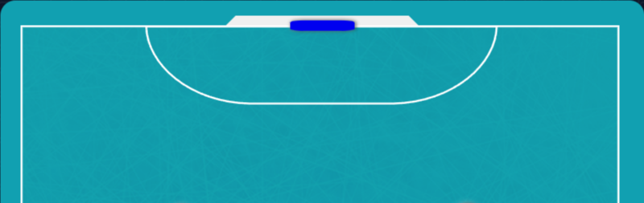

import GradientBox from '@/components/gradient-box';
import { Tab, Tabs } from 'fumadocs-ui/components/tabs';

<GradientBox></GradientBox>

## getTopPole(): Point

Retorna o ponto da trave superior do gol.

```php
$goal->getTopPole();
```

## getCenter(): Point

Retorna o ponto central do gol.

```php
$goal->getCenter();
```

## getTopPole(): Point

Retorna o ponto da trave inferior do gol.

```php
$goal->getTopPole();
```

## getPlace(): Side

Retorna o lado do campo onde o gol está.

```php
$goal->getPlace();
```

## HOME(): IGoal

Retorna o gol do lado HOME.

```php
Goal::HOME();
```

## AWAY(): IGoal

Retorna o gol do lado AWAY.

```php
Goal::AWAY();
```

## Métodos

```php
getCenter(): Point;
getPlace(): Side;
getTopPole(): Point;
getBottomPole(): Point;
HOME(): IGoal;
AWAY(): IGoal;
```
