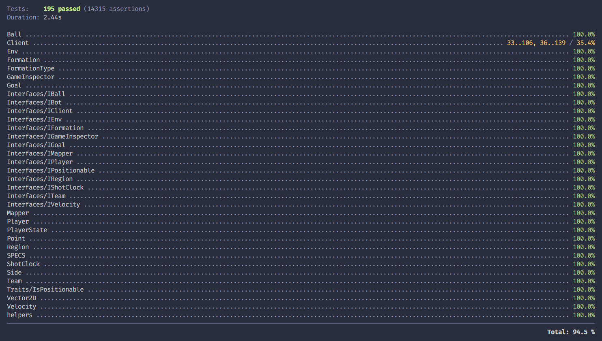

import { Accordion, Accordions } from 'fumadocs-ui/components/accordion';
import GradientBox from '@/components/gradient-box';
import Contact from '@/components/contact';
import { icons } from '@/app/source';

## O que é o lugo4php ?
Lugo4PHP é um pacote feito em PHP criado para conectar um bot com servidor do Lugo Bots, 
escondendo a complexidade da conexão gRPC e disponibilizando várias classes e 
métodos que auxiliam um desenvolvedor a criar um bot para Lugo Bots.
<GradientBox>

</GradientBox>

## Guias
<Cards>
  <Card title="Iniciando um novo bot" href="/start-new-bot" icon={<icons.Pacifier />} />
</Cards>

## Classes
<Cards>
  <Card title="Bot" href="/bot" icon={<icons.RiRobot2Line />} />
  <Card title="GameInspector" href="/game-inspector" icon={<icons.FaMagnifyingGlass />} />
  <Card title="Ball" href="/ball" icon={<icons.PiSoccerBallFill />} />
  <Card title="Env" href="/env" icon={<icons.PiGear />} />
  <Card title="Formation" href="/formation" icon={<icons.Formation />} />
  <Card title="Goal" href="/goal" icon={<icons.GiGoalKeeper />} />
  <Card title="Mapper" href="/mapper" icon={<icons.LuMap />} />
  <Card title="Player" href="/player" icon={<icons.FiUser />} />
  <Card title="Region" href="/region" icon={<icons.TbSoccerField />} />
  <Card title="Team" href="/team" icon={<icons.RiTeamLine />} />
  <Card title="Point" href="/point" icon={<icons.PiVectorTwoFill />} />
  <Card title="Vector2D" href="/vector2d" icon={<icons.PiVectorTwoDuotone />} />
  <Card title="Velocity" href="/velocity" icon={<icons.GiVelociraptor />} />
  <Card title="ShotClock" href="/shot-clock" icon={<icons.LuAlarmClock />} />
</Cards>

## Enums
<Cards>
  <Card title="PlayerState" href="/player-state" icon={<icons.FaFlagUsa />} />
  <Card title="Side" href="/side" icon={<icons.FaArrowsLeftRight />} />
</Cards>

## FAQ

<Accordions>
<Accordion title="Para quê serve a função beforeActions() ?">
Esse método sempre é chamado logo antes dos métodos `onDisputing`, `onDefending`, `onHolding`, `onSupporting` e `asGoalkeeper`.

Esse serve para ocasiões onde você tem um dado no seu bot que você quer atualizar sempre antes das ações, para que elas tenham esse dado sempre atualiazdo.

Por exemplo digamos que você tem um dado X, que é computado ou seja você precisa calcular ele sempre, o que você pode fazer é como o exemplo abaixo.
```php
<?php

use Lugo4php\Interfaces\IBot;

class Bot implements IBot
{
	public int $seuDadoComputado = 0;

	public function afterActions(GameInspector $inspector): void {
    $this->seuDadoComputado = $this->metodoQueCalculaODado();
  }

  private function metodoQueCalculaODado() {
    // seu código aqui...
  }
}
```
 
</Accordion>
<Accordion title="Para quê serve a função afterActions() ?">
Esse método sempre é chamado logo depois dos métodos `onDisputing`, `onDefending`, `onHolding`, `onSupporting` e `asGoalkeeper`.

Esse serve para ocasiões onde você tem um dado no seu bot que você quer atualizar sempre depois das ações, para que elas no próximo turno tenha o dado do turno anterior, ou apenas para que você atualize sempre depois e não precise fazer isso em vários locais.

Por exemplo digamos que você queira salvar o último holder (jogador que está com a bola), o que você pode fazer é, por exemplo:
```php
<?php

use Lugo4php\Interfaces\IBot;

class Bot implements IBot
{
  public int $lastHolder = null;

  public function afterActions(GameInspector $inspector): void {
    if($inspector->getBallHasHolder()) {
      $this->lastHolder = $inspector->getBallHasHolder();
    }
  }

  public function onDisputing(GameInspector $inspector): array
  {
      if($this->lastHolder->getTeamSide() === $inspector->getMyTeamSide()) {
        // humm, se o último holder foi alguém do meu time e agora a bola, 
        // não está com ninguém... será que é um passe ?
        // hummmmmmmm, nah.
      }
  }
}
```
</Accordion>
<Accordion title="O que são os métodos que começam com `try` ?">
 
My Content
 
</Accordion>
</Accordions>

## Seguestões são bem vindas! 🤩

<Contact />

