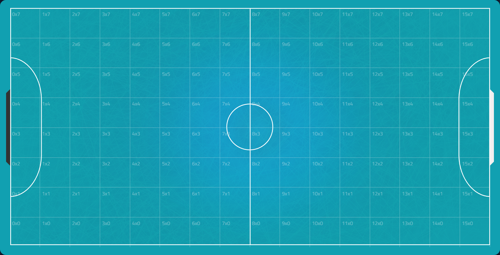
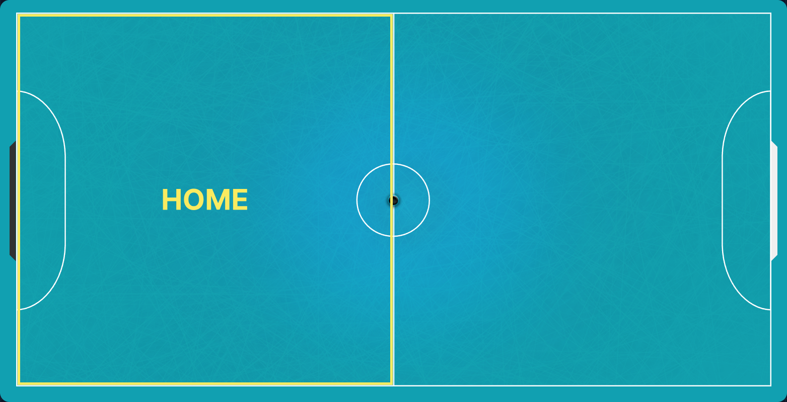
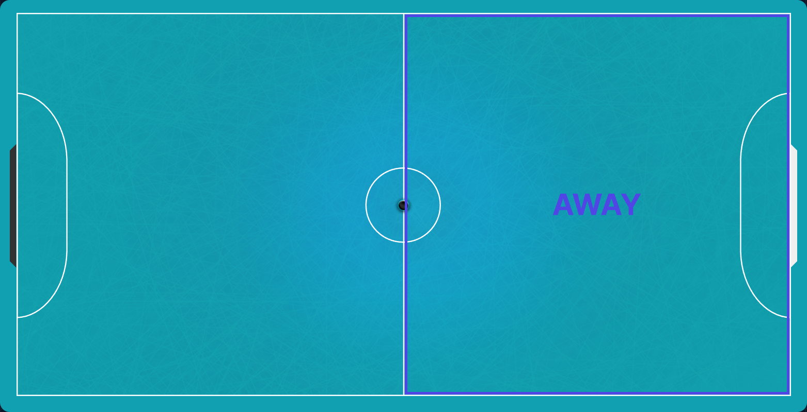
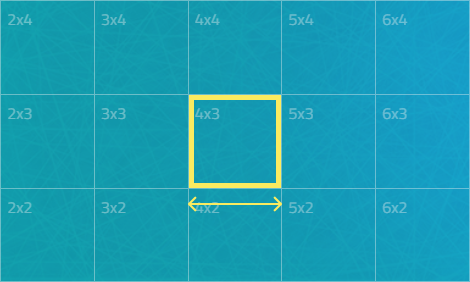
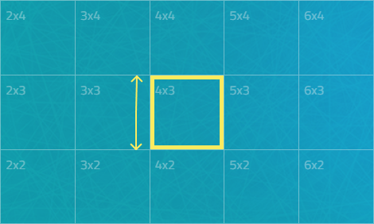
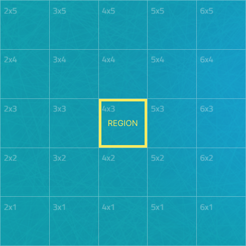
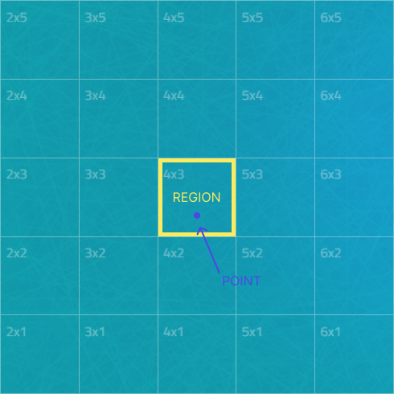

import GradientBox from '@/components/gradient-box';
import { Tab, Tabs } from 'fumadocs-ui/components/tabs';

<GradientBox>

</GradientBox>

## getCols(): int
Retorna o total de colunas que o campo foi fatiado.
```php
$mapper->getCols();
```

## setCols(int $cols): self
Define o total de colunas que o campo foi fatiado.
```php
$mapper->setCols(12);
```

## setRows(): int
Retorna o total de linhas que o campo foi fatiado.
```php
$mapper->setRows();
```

## setRows(int $cols): self
Define o total de linhas que o campo foi fatiado.
```php
$mapper->setRows(12);
```

## getSide(): Side
Define o lado do campo com o qual o mapper está se baseando.
```php
$mapper->getSide();
```
<GradientBox>
<Tabs items={['HOME', 'AWAY']}>
  <Tab value="HOME"></Tab>
  <Tab value="AWAY"></Tab>
</Tabs>
</GradientBox>

## getRegionWidth(): float
Retorna a largura das regiões do campo.
```php
$mapper->getRegionWidth();
```
<GradientBox>

</GradientBox>

## getRegionHeight(): float
Retorna a altura das regiões do campo.
```php
$mapper->getRegionHeight();
```
<GradientBox>

</GradientBox>

## getRegion(int $col, int $row): IRegion
Retorna uma região especifíca.
```php
$region = $mapper->getRegion(4, 3);
```
<GradientBox>

</GradientBox>

## getRegionFromPoint(Point $point): IRegion
Retorna uma região onde contém um ponto X.
```php
$point = new Point(500, 5000);
$region = $mapper->getRegionFromPoint($point);
```
<GradientBox>

</GradientBox>

## getRandomRegion(): IRegion
Retorna uma região aleatória do campo.
```php
$region = $mapper->getRandomRegion();
```

## Métodos
```php
getCols(): int;
setCols(int $cols): self;
getRows(): int;
setRows(int $rows): self;
getRegionWidth(): float;
getRegionHeight(): float;
getSide(): Side;
getRegion(int $col, int $row): IRegion;
getRegionFromPoint(Point $point): IRegion;
getRandomRegion(): IRegion;
```
