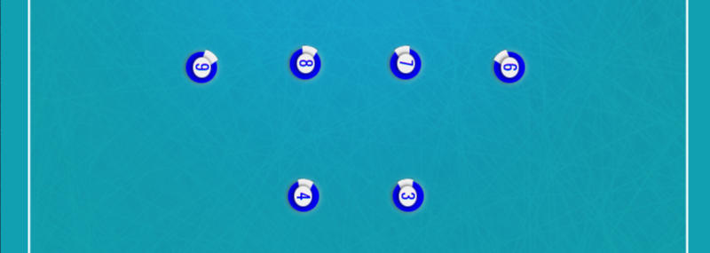

import GradientBox from '@/components/gradient-box';

<GradientBox>

</GradientBox>

## getNumber(): int
Retorna o número do jogador.
```php
$player->getNumber();
```

## getSpeed(): int
Retorna a velocidade atual do jogador.
```php
$player->getSpeed();
```

## getDirection(): Vector2D
Retorna a direção atual do jogador.
```php
$player->getDirection();
```

## getPosition(): Point
Retorna a posição atual do jogador.
```php
$player->getPosition();
```

## getVelocity(): Velocity
Retorna a velocity atual do jogador.
```php
$player->getVelocity();
```

## getTeamSide(): Side
Retorna o lado do campo que o time do jogador pertence.
```php
$player->getTeamSide();
```

## getInitPosition(): Point
Retorna a posição inicial do jogador.
```php
$player->getInitPosition();
```

## getIsJumping(): bool
Retorna verdadeiro se o jogador está  pulando. Atualmente apenas o goleiro pode pular.
```php
$player->getIsJumping();
```

## isGoalkeeper(): bool
Retorna verdadeiro se o jogador é um goleiro.
```php
$player->isGoalkeeper();
```

## is(Player $player): bool
Retorna verdadeiro se o jogador é o jogador dado.
```php
$inspector->getMyPlayer(6);
$player->is($otherPlayer);
```

## eq(Player $player): bool
Retorna verdadeiro se o jogador é o jogador dado.
```php
$inspector->getMyPlayer(6);
$player->eq($otherPlayer);
```

## isInAttackSide(): bool
Retorna verdadeiro se o jogador está na metade do campo que pertence ao adverssário.

Exemplo 1: Se jogador percente ao time do lado HOME, `isInAttackSide()` irá retornar `true` se o jogador estiver no lado AWAY.

Exemplo 2: Se jogador percente ao time do lado AWAY, `isInAttackSide()` irá retornar `true` se o jogador estiver no lado HOME.
```php
$player->isInAttackSide();
```

## isInDefenseSide(): bool
Retorna verdadeiro se o jogador está na metade do campo que pertence ao time dele mesmo.

Exemplo 1: Se jogador percente ao time do lado HOME, `isInDefenseSide()` irá retornar `true` se o jogador estiver no lado HOME.

Exemplo 2: Se jogador percente ao time do lado AWAY, `isInDefenseSide()` irá retornar `true` se o jogador estiver no lado AWAY.
```php
$player->isInDefenseSide();
```

## directionToPlayer(Player $player): Vector2D
Retorna a direção que um jogador precisa se dirigir para ir em direção a algum outro jogador.
```php
$player->directionToPlayer($otherPlayer);
```

## distanceToPlayer(Player $player): float
Retorna a distância entre o jogador e algum outro jogador.
```php
$player->distanceToPlayer($otherPlayer);
```

## directionToPoint(Point $point): Vector2D
Retorna a direção que um jogador precisa se dirigir para ir em direção a um ponto.
```php
$player->directionToPoint($point);
```

## distanceToPoint(Point $point): float
Retorna a distância entre o jogador e um ponto.
```php
$player->distanceToPoint($point);
```

## directionToRegion(IRegion $region): Vector2D
Retorna a direção que um jogador precisa se dirigir para ir em direção ao centro de uma região.
```php
$player->directionToRegion($region);
```

## distanceToRegion(IRegion $region): float
Retorna a distância entre o jogador e o centro de uma região.
```php
$player->distanceToRegion($region);
```

## Métodos

```php
getNumber(): int;
getSpeed(): float;
getDirection(): Vector2D;
getPosition(): Point;
getVelocity(): Velocity;
getTeamSide(): Side;
getInitPosition(): Point;
getIsJumping(): bool;
isGoalkeeper(): bool;
is(Player $player): bool;
eq(Player $player): bool;

isInAttackSide(): bool;
isInDefenseSide(): bool;

directionToPlayer(Player $player): Vector2D;
directionToPoint(Point $point): Vector2D;
directionToRegion(IRegion $region): Vector2D;
distanceToPlayer(Player $player): float;
distanceToPoint(Point $point): float;
distanceToRegion(IRegion $region): float;
```
