import GradientBox from '@/components/gradient-box';
import { Tab, Tabs } from 'fumadocs-ui/components/tabs';

## is(IRegion $region): bool

Retorna verdadeiro se uma região é igual a outra.

```php
$region->is($otherRegion);
```

## eq(IRegion $region): bool

Retorna verdadeiro se uma região é igual a outra.

```php
$region->eq($otherRegion);
```

## getCol(): int

Retorna a coluna da região.

```php
$region->getCol();
```

## getRows(): int

Retorna a linha da região.

```php
$region->getRows();
```

## getCenter(): Point

Retorna o pronto central da região.

```php
$region->getCenter();
```

## front(): IRegion

Retorna a região que está a frente.

```php
$region->front();
```

<GradientBox>
    <Tabs items={['HOME', 'AWAY']}>
        <Tab value="HOME">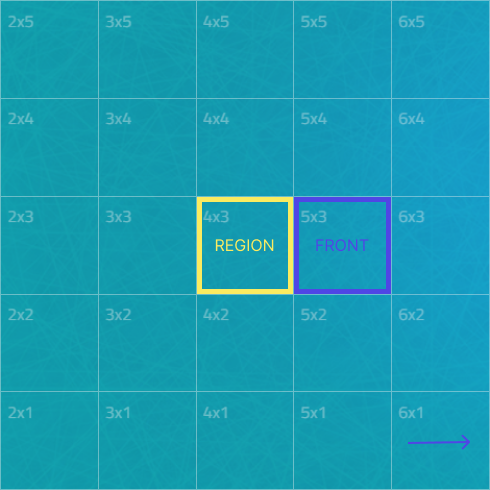</Tab>
        <Tab value="AWAY">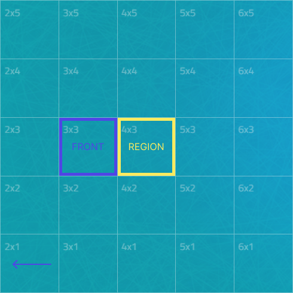</Tab>
    </Tabs>
</GradientBox>

## back(): IRegion

Retorna a região que está atrás.

```php
$region->back();
```

<GradientBox>
    <Tabs items={['HOME', 'AWAY']}>
        <Tab value="HOME">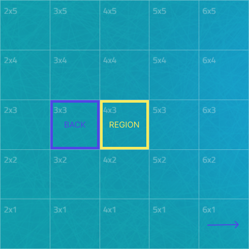</Tab>
        <Tab value="AWAY">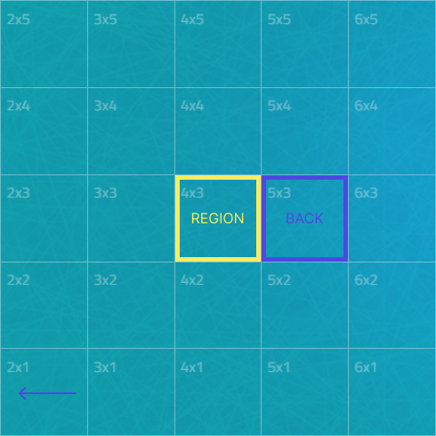</Tab>
    </Tabs>
</GradientBox>

## left(): IRegion

Retorna a região que está a esquerda.

```php
$region->left();
```

<GradientBox>
    <Tabs items={['HOME', 'AWAY']}>
        <Tab value="HOME">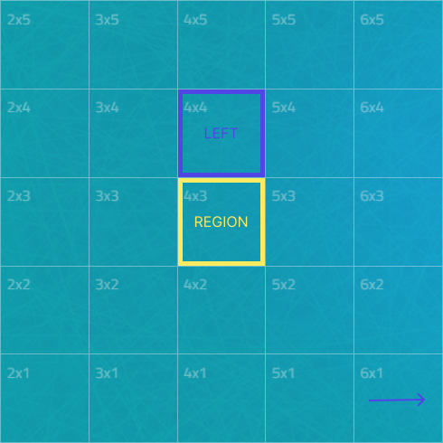</Tab>
        <Tab value="AWAY">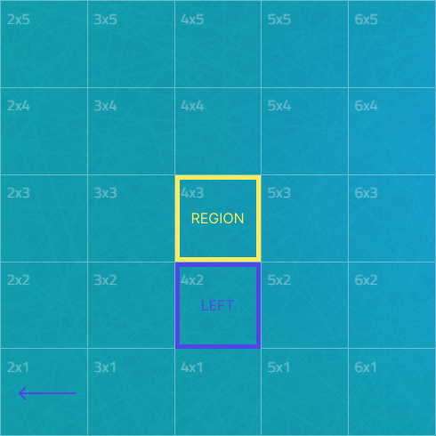</Tab>
    </Tabs>
</GradientBox>

## right(): IRegion

Retorna a região que está a direita.

```php
$region->right();
```

<GradientBox>
    <Tabs items={['HOME', 'AWAY']}>
        <Tab value="HOME">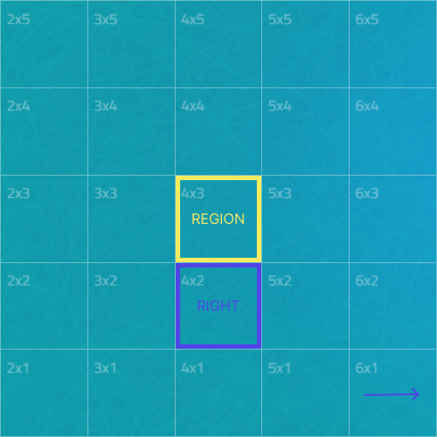</Tab>
        <Tab value="AWAY">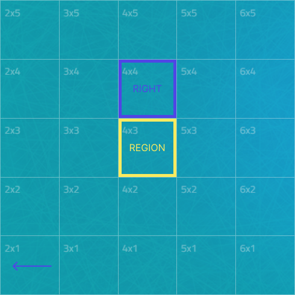</Tab>
    </Tabs>
</GradientBox>

## frontRight(): IRegion

Retorna a região que está a frente e a direita.

```php
$region->frontRight();
```

<GradientBox>
    <Tabs items={['HOME', 'AWAY']}>
        <Tab value="HOME">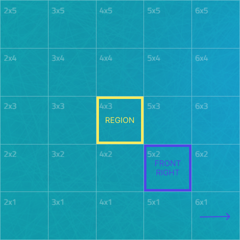</Tab>
        <Tab value="AWAY">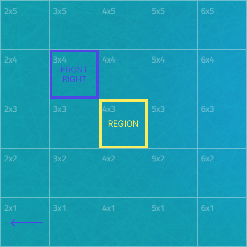</Tab>
    </Tabs>
</GradientBox>

## frontLeft(): IRegion

Retorna a região que está a frente e a esquerda.

```php
$region->frontLeft();
```

<GradientBox>
    <Tabs items={['HOME', 'AWAY']}>
        <Tab value="HOME">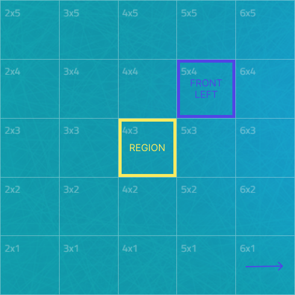</Tab>
        <Tab value="AWAY">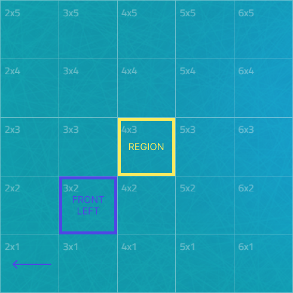</Tab>
    </Tabs>
</GradientBox>

## backRight(): IRegion

Retorna a região que está atrás e a direita.

```php
$region->backRight();
```

<GradientBox>
    <Tabs items={['HOME', 'AWAY']}>
        <Tab value="HOME">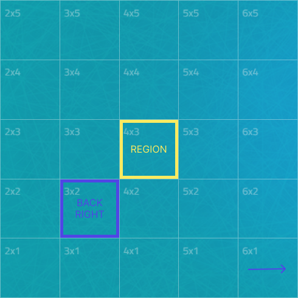</Tab>
        <Tab value="AWAY">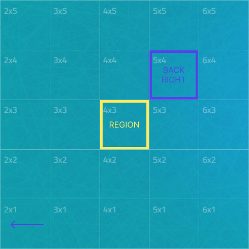</Tab>
    </Tabs>
</GradientBox>

## backLeft(): IRegion

Retorna a região que está atrás e a esquerda.

```php
$region->backLeft();
```

<GradientBox>
    <Tabs items={['HOME', 'AWAY']}>
        <Tab value="HOME">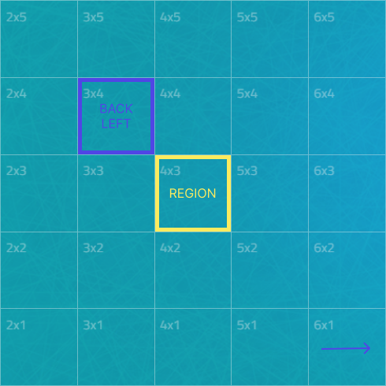</Tab>
        <Tab value="AWAY">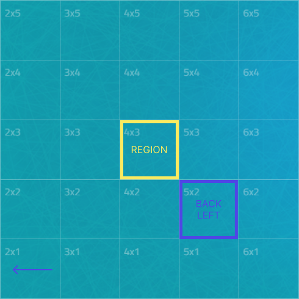</Tab>
    </Tabs>
</GradientBox>

## coordinates(): IPositionable

Retorna um ponto em que o eixo X é a coluna e o eixo Y é a linha da região.

```php
$region->coordinates();
```

## distanceToRegion(IRegion $region): float

Retorna a distância entre a região e uma outra região, sendo 1 undade o tamanho de 1 região.

Exemplo: `$regionA->distanceToRegion($regionB);` retornou 2.5 entçao signifiica que a distância
entre `$regionA` e `$regionB` é de 2.5 REGIÕES e NÃO unidades de distância, (pixels, d.).

```php
$region->distanceToRegion($otherRegion);
```

## distanceToPoint(Point $point): float

Retorna a distância entre o centro região e um ponto.

```php
$region->distanceToPoint($point);
```

## containsPlayer(Player $player): bool

Retorna verdadeiro se a região contém o jogador, ou seja o jogador estão posicionado dentro da
região.

```php
$region->containsPlayer($player);
```

## \_\_toString(): string

Retorna as coordenadas da região em forma de string, ex.: `"[5, 8]"`.

```php
echo $region;
echo sprintf("Coordenadas %s", $region);
```

## Métodos

```php
is(IRegion $region): bool;
eq(IRegion $region): bool;

getCol(): int;
getRow(): int;

getCenter(): Point;

frontRight(): IRegion;
front(): IRegion;
frontLeft(): IRegion;
backRight(): IRegion;
back(): IRegion;
backLeft(): IRegion;
left(): IRegion;
right(): IRegion;

coordinates(): IPositionable;

distanceToRegion(IRegion $region): float;
distanceToPoint(Point $point): float;

containsPlayer(Player $player): bool;

__toString(): string;
```
