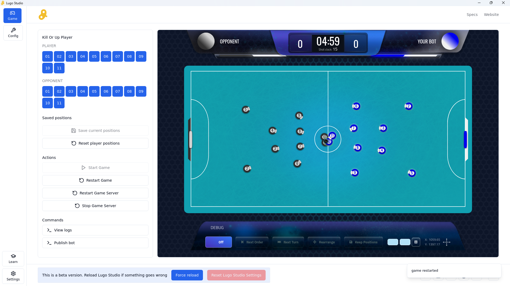

import GradientBox from '@/components/gradient-box';
import { Step, Steps } from 'fumadocs-ui/components/steps';
import { File, Folder, Files } from 'fumadocs-ui/components/files';
import { Blockquote } from '@/components/blockquote';

## Começando com bot base `the-dummies-php`.

<Steps>
    <Step>
        ### Primeiro clone o ` the-dummies-php` 
        
        ```bash 
        git clone https://github.com/mauriciorobertodev/the-dummies-php.git your-bot-name 
        ```
    </Step>

    <Step>
        ### Entrar na pasta

        ```bash
        cd your-bot-name
        ```
    </Step>

</Steps>

## Construa seu bot da sua maneira

<Blockquote variant="danger">
    SEMPRE importe tudo do namespace `Lugo4php`.
</Blockquote>

Você pode baixar o [lugo studio](https://lugobots.ai/how-to-play) para axuliar você nisso.

<GradientBox></GradientBox>

## Buildando e enviando o bot

Agora que seu bot está pronto para o campo de batalha, precisamos buildar ele em uma imagem docker e
enviar para o servidor.

<Steps>
    <Step>
        ### Construa a imagem do seu bot
        <Blockquote variant="info">
            Altere o nome e versão para ficar compativél com seu bot.
        </Blockquote>
        ```bash 
        docker build -f .lugo/Dockerfile.build -t repo.lugobots.ai/nome-do-deu-bot:v1 .
        ```
    </Step>
    <Step>
        ### Faça login no repositório do Lugo Bots
        <Blockquote variant="info">
            Altere para seu email que você usa para logar no lugo bots.
        </Blockquote>
        ```bash 
        docker login -u seu.email@email.com repo.lugobots.ai
        ```
    </Step>
    <Step>
        ### Faça o envio da imagem
        <Blockquote variant="info">
            Altere para o nome e tag do seu bot.
        </Blockquote>
        ```bash 
        docker push repo.lugobots.ai/nome-do-deu-bot:v1
        ```
    </Step>
</Steps>
